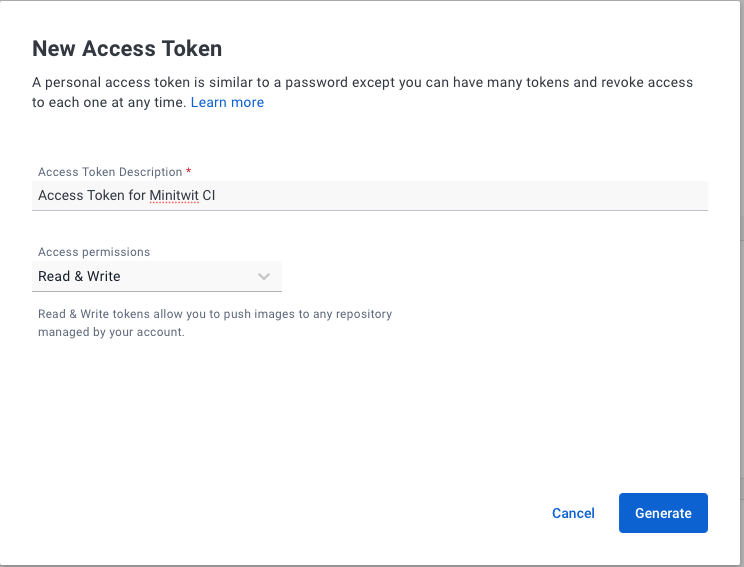
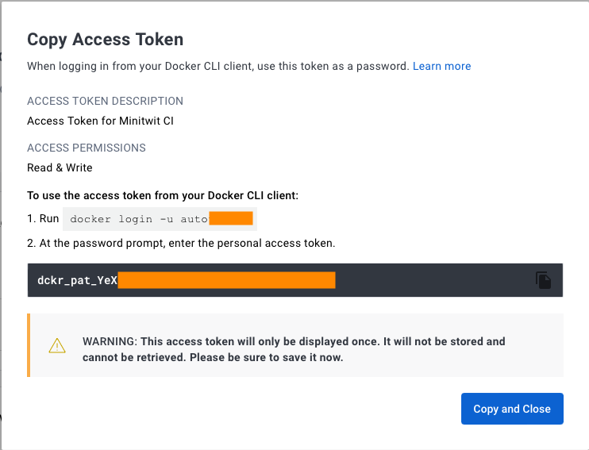
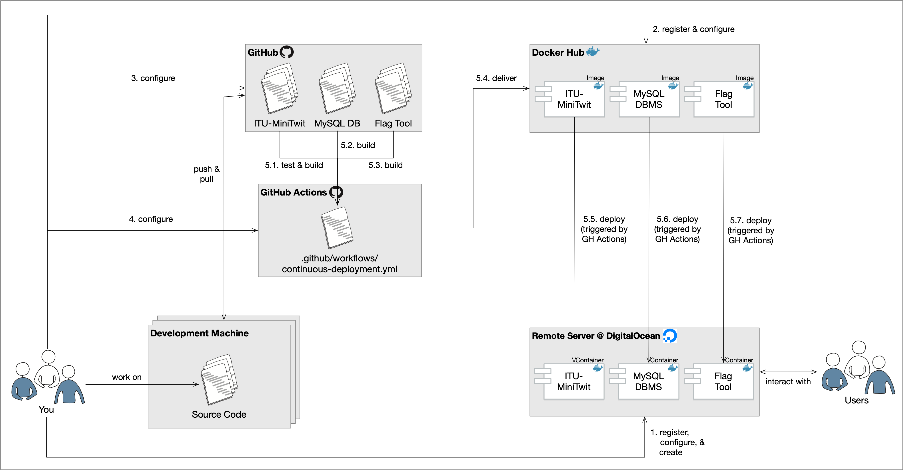
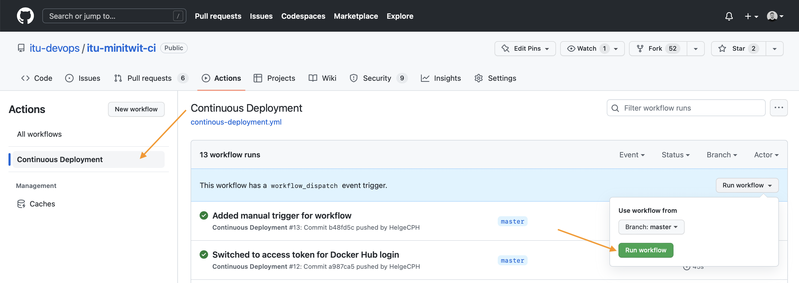

# ITU-MiniTwit CI/CD Scenario

## 1.) Requirements

  * You need to be signed up to GitHub Education (https://education.github.com).
  * You need to be signed up at DigitalOcean (https://www.digitalocean.com/).
    - You can use the $100 credit provided by GitHub Education to create a new account.
  * Fork this repository (https://github.com/itu-devops/itu-minitwit-ci) by clicking on the fork button on GitHub
  * Clone your fork of the repository:

  ```bash
  $ git clone https://github.com/<your_gh_user>/itu-minitwit-ci.git
  $ cd itu-minitwit-ci
  ```
  * In case you are not already, register at Docker Hub (https://hub.docker.com/)
    - To make a later step more straight forward, use a password without any special characters.
    - From now on we refer to your login ID from Docker Hub as `DOCKER_USERNAME` and your password there is called `DOCKER_PASSWORD`.
    - It is recommended to use an access token for Docker Hub instead of your password. You can generate one at https://hub.docker.com/settings/security.
      - Select `New Access Token` and give it a description, e.g., `Access Token for Minitwit CI`.
      - Under Access permissions, select `Read & Write`
      
      - Copy the generated token and use it as your `DOCKER_PASSWORD` in the steps that are described below.
      
  * Login at Docker Hub and create three public repositories with the following names (by clicking the big blue `Create Repository` button in the top right).
    - `mysqlimage`
    - `minitwitimage`
    - `flagtoolimage`

  * When using the `Vagrantfile`, export your Docker Hub credentials as environment variables.

  | :warning: WARNING          |
  |:---------------------------|
  | **OBS:** Remember to **not push these credentials back to a public repository**. |

  ```bash
  export DOCKER_USERNAME=<your_docker_hub_username>
  export DOCKER_PASSWORD=<your_docker_hub_password>
  export DIGITAL_OCEAN_TOKEN=<your_digital_ocean_token>
  ```

  * Setup GitHub Action Secrets
    - Navigate to the repository settings on GitHub (`Settings` tab to the top right, with cog wheel)
    - Under `Security`, `Secrets and variables`, click `Actions` and select `New repository secret`
    - Add `DOCKER_USERNAME` and `DOCKER_PASSWORD` to allow the GitHub Action to push to Docker Hub
    

----

To setup this scenario we have two parts:
- A remote server to which we will deploy our ITU-MiniTwit application and which is provisioned on DigitalOcean using `vagrant`.
- A GitHub Actions workflow, which we will use to automate tests, build the application (in Docker images) and deploy them to the server.




----

# Preparation

## 2.) SSH Key Pair

To connect to the server we are going to provision, we will use RSA keys for authentication. We will provide the same SSH keys to the GitHub Action workflow, so that it can automatically deploy new versions on our server.

Now, create a keypair as illustrated below.

```bash
ssh-keygen -f ~/.ssh/do_ssh_key -t rsa -b 4096 -m "PEM"
```

Hit enter two times to accept the other defaults. You can call the SSH key files whatever you want, but the `Vagrantfile` expects the SSH keys to have that specific name. So in case you use another name, adapt the `Vagrantfile` accordingly.


## 2.1.) Register your Public SSH at DigitalOcean

Now, after generating the key pair, log into DigitalOcean and navigate to the security configuration, left under `Settings` -> `Security` (second tab).

Under `SSH keys` click the `Add SSH Key` button and register a `New SSH key` with the name `do_ssh_key`. Paste into the input field the contents of `~/.ssh/do_ssh_key.pub`, which you might receive via: `cat ~/.ssh/do_ssh_key.pub` on the command line.

--------------------

# 3.) Creating a Remote Server

## Vagrant DigitalOcean Plugin

We assume you have `vagrant` and the Vagrant DigitalOcean plugin installed, see [session 3 prep. notes](https://github.com/itu-devops/lecture_notes/blob/master/sessions/session_03/README_PREP.md).


## DigitalOcean Token

To create virtual machines at DigitalOcean with `vagrant` we must generate an authentication token. If you did so already during the last exercise session, you can skip this section. Otherwise, log into DigitalOcean in your browser, then navigate to `API` in the menu on the right, then click on `Generate New Token`. You must give it a name, for example the name of the machine where you use the token.


The `Vagrantfile` expects to find your DigitalOcean token in a respective environment variable in your shell environment. For example, you can  add it to your `~/.bashrc` or `~/.zshrc`. The variable must be called: called `DIGITAL_OCEAN_TOKEN`, the syntax for defining such an environment variable in your shell configuration file is:

```bash
export DIGITAL_OCEAN_TOKEN=<your-token>
```

After adding the token you must reload your shell. Either close your current terminal and open a new one or use the `source` command on the shell config file you changed, e.g., `source ~/.bashrc`.


## Starting the Remote Server

Now, you should be able to create the remote VM via `vagrant up`. You can use the below command to ensure that vagrant will use the DigitalOcean provider:

```bash
export DOCKER_USERNAME=<your_docker_hub_username>
export DOCKER_PASSWORD=<your_docker_hub_password>
export DIGITAL_OCEAN_TOKEN=<your_digital_ocean_token>

vagrant up --provider=digital_ocean
```


Note down the IP of this server as we will need it in a later step. It should be displayed after the server was created.


### `/remote_files`

All files contained in the directory `remote_files` will be synced to the newly provisioned server. Currently, this is only a single `docker-compose.yml` file, which later will be used to deploy our ITU-MiniTwit application automatically.

<!--
When the server has finished initalizing, it use docker-compose file to start minitwtit with the command `docker-compose up -d`. The `up` command actually does a lot of things: first it will check if the images specified in the docker-compose.yml are present, if they are not it will attempt to pull them from `hub.docker.com` or any other private registries it might be signed into. Next the `up` command will check if there are any running conatiners of the images, and if there are none, it will create them, if they are present, but an older version, the images that have a newer version available will be recreated with newer version. If all containers are up to date, then nothing will happen. The `-d` will start the docker containers as `daemons` in the background.

Whenever the `mysql` container is restarted it needs ~20 seconds to initialize, so don't panic if the url shows a mysql error, just wait a moment and reload the page.
-->

### SSH to server

If you need to SSH to remote server you can easily do it through `vagrant` with the `ssh` command:

```bash
$ vagrant ssh
```

Create `~/.ssh/config` if it does not exist and add the following lines:

```
Host minitwit
  HostName <ip-address-of-your-server>
  User root
  IdentityFile ~/.ssh/do_ssh_key
  IdentitiesOnly yes
```

Verify that you can connect to the server via SSH `ssh minitwit`.

You can also do it 'manually' like so:

```bash
$ ssh root@<digital-ocean-machine-ip> -i <path_to/do_ssh_key>
```

------


# GitHub Action workflow

Now, we will setup the GitHub Action workflow.

##  4.) Configuration


#### Environment Variables

For this scenario, we have to share the SSH key in order to be able to connect to the remote server.
As before, navigate to the repository settings on GitHub. Under `Security`, `Secrets and variables`, click `Actions` and select `New repository secret`.

For this scenario you must set the following environment variables:

- `DOCKER_USERNAME` username for hub.docker.com
- `DOCKER_PASSWORD` password for username for hub.docker.com
- `SSH_USER` the user as whom we will connect to the server at DigitalOcean, default is `root`
- `SSH_KEY` the **private** SSH key we generated earlier (not the public key, if you followed the instructions it should be located at `~/.ssh/do_ssh_key`)
- `SSH_HOST` the IP address of the server (or DNS name) we created on DigitalOcean, which you noted down earlier.


These are key-value pairs that are substitutes for their actual value when the workflow runs. They are never printed to any logs, so this is the way to add "secrets" to your workflow, like login usernames and passwords.

## 5.) `continous-deployment.yml` - A workflow's Configuration File

To build _ITU-MiniTwit_ using GitHub Actions workflows, we must add a file to the  of the `.github/workflows` this repository called `continous-deployment.yml` that contains all of the commands to be executed by the workflow. The nice thing about this being a file in our Git repository is that we can version it along with the rest of our code and keep all of our code and configuration in the same place without having to use any web GUI's - Configuration as Code!

The scenario should already have a sample [continous-deployment.yml](.github/workflows/continous-deployment.yml) in the repository.


This workflow is divided into several stages:

  - `Checkout`
    - Clone the repository and checkout the latest commit.
  - `Docker`
    - Login to hub.docker.com
    - Setup Docker
    - Build the Docker images for minitwit.

    If the test fails the workflow will abort and alert you that the tests are failing.
  - `Deploy`
    - The final step logs into the server and deploys the new version to our remote server by opening an SSH connection and, which remotely sets-up the environment variables (`source /root/.bash_profile`), pulls the freshly built Docker images from hub.docker.com (`docker-compose pull`), and finally updates the running containers to the new version (`docker-compose up -d`).

Note, that each stage is executed in a freshly provisioned VM on GitHub Actions, so no state carries over from one stage to another, unless you explicitly tell GitHub Actions to do so.

## Trigger workflow

Now we are ready to trigger the workflow. If all of the above went well, a new version of _ITU-MiniTwit_ should be build, tested, delivered, and deployed on every new commit to the repository.



---

# Troubleshooting
If you have error with the `vagrant up` command, you can try to run it with the `VAGRANT_LOG=debug` environment variable set to get more information about the error. For example:
```bash
VAGRANT_LOG=debug vagrant up --provider=digital_ocean
```

# Credits

This scenario exists only due to the hard work of the TAs:
  * 2020: [Zander](https://github.com/zanderhavgaard) and [Christoffer](https://github.com/ChristofferNissen)
  * 2021: [Michal](https://github.com/tschesky)
  * 2023: [Gianmarco](https://github.com/gianmarcomurru)
---


For some more details on the Docker images see the file `readme_dockerized.md`
